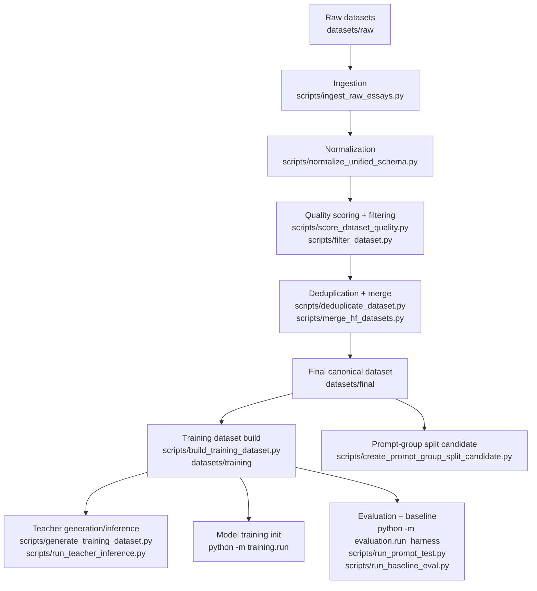

# Cogni-SLM Architecture

## End-to-End Dependency Graph

## Code Organization

- `scripts/`: thin, backward-compatible CLI wrappers.
- `src/data/`: dataset acquisition, ingestion, normalization, quality, dedup, split, rebuild implementations.
- `src/evaluation/`: prompt test and baseline evaluation implementations plus shared evaluation interfaces.
- `src/inference/`: local inference runner implementation.
- `src/training/`: training entrypoint scaffolds migrated from script layer.
- `src/utils/`: shared path helpers and reusable utility functions.
- `evaluation/`: reusable base-vs-tuned harness package.
- `training/`: stable runtime training package.

## Runtime Artifact Conventions

- Reports default to `docs/reports/`.
- Evaluation artifacts default to `outputs/evaluation/`.
- Rebuild artifacts default to `outputs/rebuild/` and synchronized dataset targets.
- Experiment outputs should be written under `outputs/experiments/`.

## Compatibility Guarantees

- Existing script entrypoints remain usable.
- Existing test imports from `scripts/*.py` remain supported via wrapper attribute forwarding.
- Training config supports `configs/training/` with fallback to legacy `training/configs/`.
