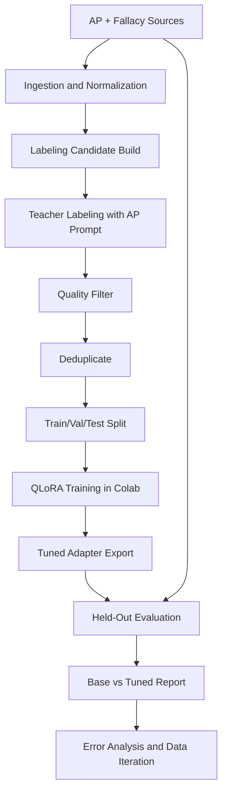

# Cogni-SLM Architecture (AP Tutor)

```mermaid
flowchart TD
    A[AP + Fallacy Sources] --> B[Ingestion and Normalization]
    B --> C[Labeling Candidate Build]
    C --> D[Teacher Labeling with AP Prompt]
    D --> E[Quality Filter]
    E --> F[Deduplicate]
    F --> G[Train/Val/Test Split]
    G --> H[QLoRA Training in Colab]
    H --> I[Tuned Adapter Export]
    I --> J[Held-Out Evaluation]
    A --> J
    J --> K[Base vs Tuned Report]
    K --> L[Error Analysis and Data Iteration]
```

## Primary Artifacts
- Dataset (primary deliverable)
- Fine-tuned adapter/model
- Evaluation harness and results
- Error analysis and iteration notes
