# Project Dependency Graph

## Scope
This graph documents the production pipeline modules currently wired in the repository for:
- datasets
- teacher pipeline
- review pipeline
- gold dataset build
- SFT build/export
- training
- evaluation
- dashboard
- experiment tracking

It focuses on executable entry modules plus core shared modules they depend on.

## System Graph

```mermaid
flowchart TB
    raw["datasets/raw/*"]
    evalset["datasets/eval/*.jsonl"]
    goldset["datasets/gold/*.jsonl"]
    reviews["datasets/review/reviews.jsonl"]

    cfg_teacher["configs/teacher/*.json"]
    cfg_providers["configs/providers/providers_v1.json"]
    cfg_training["configs/training/experiments/*.json + qlora_default.json"]
    env[".env"]
    prompts["teacher_prompts/production_teacher.txt + teacher_prompts/versions/*"]
    schema["teacher_prompts/output_schema.json + teacher_schemas/*.json"]

    subgraph Datasets
      hfbuild["datasets/build_dataset.py"]
      ingest["src/data/ingest_raw_essays.py"]
      dsbuild["src/data/build_dataset.py"]
      rebuild["src/data/rebuild_all.py"]
      goldbuild["src/data/build_gold_dataset.py"]
      sftbuild["src/data/build_sft_dataset.py"]
      prodwf["src/data/generate_production_dataset.py"]
    end

    subgraph Teacher
      providercfg["src/teacher/provider_config.py"]
      preg["src/teacher/prompt_registry.py"]
      providers["src/teacher/providers/*"]
      tvalid["src/teacher/validation.py"]
      genlabels["src/teacher/generate_labels.py"]
      run_one["src/teacher/run_teacher_experiment.py"]
      run_multi["src/teacher/run_teacher_experiments.py"]
      run_exec["src/teacher/run_teacher_benchmark_execution.py"]
      run_ens["src/teacher/run_teacher_ensembles.py"]
      bench_cli["src/teacher/run_benchmark.py"]
      bench_core["src/teacher/benchmark.py"]
      lboard["src/teacher/leaderboard.py"]
    end

    subgraph Review
      qbuild["src/review/build_review_queue.py"]
      rserver["src/review/server.py"]
      rmerge["src/review/merge_reviews.py"]
    end

    subgraph Training
      trainrun["src/training/train_experiment.py"]
      traininit["src/training/train_unsloth.py"]
      tracker["src/utils/experiment_tracker.py"]
    end

    subgraph Evaluation
      evloader["src/evaluation/benchmark.py"]
      baseline["src/evaluation/run_baseline_eval.py"]
      calib["src/evaluation/calibration.py"]
      err["src/evaluation/error_analysis.py"]
    end

    subgraph Dashboard
      dash["src/dashboard/build_dashboard.py"]
    end

    raw --> hfbuild
    raw --> ingest
    raw --> dsbuild
    raw --> rebuild

    hfbuild --> hfdata["datasets/hf/dataset_dict + datasets/hf/build_summary.json"]
    ingest --> rawnorm["datasets/processed/raw_essays.jsonl + outputs/data_ingestion/report.md"]
    hfdata --> dsbuild

    dsbuild --> finalds["datasets/final/* + datasets/training/* + datasets/training_provenance/*"]
    dsbuild --> dsreports["docs/reports/{raw_verification,schema_mapping,unified_sanitization,final_dataset_quality,deduplication,license_verification,provenance,training_dataset,final_verification,reproducibility}.md"]
    rebuild --> finalds
    rebuild --> rebuildrpt["docs/reports/rebuild.md + metadata_leakage.md + group_split.md"]

    prompts --> preg
    preg --> run_one
    cfg_providers --> providercfg
    env --> providercfg
    providercfg --> run_one
    providercfg --> run_multi
    providercfg --> run_exec
    providers --> run_one
    providers --> run_exec
    cfg_teacher --> run_multi
    cfg_teacher --> run_exec
    cfg_teacher --> run_ens
    cfg_teacher --> bench_core

    goldset --> run_one
    goldset --> run_multi
    goldset --> run_exec
    run_one --> truns["outputs/teacher_runs/<run_id>/{responses,validation_results,failures,summary,manifest}.json*"]
    run_multi --> truns
    run_exec --> tbench["outputs/teacher_benchmark/<run_id>/{responses,cost,latency,confidence,metadata}/*"]

    truns --> run_ens
    run_ens --> tens["outputs/teacher_runs/ensembles/<run_id>/{ensemble_outputs,summary}.json*"]

    goldset --> bench_cli
    truns --> bench_cli
    bench_cli --> bench_core
    bench_core --> tbench
    truns --> lboard
    lboard --> lbreport["docs/reports/teacher_leaderboard.md + docs/reports/teacher_leaderboard.json"]

    truns --> qbuild
    goldset --> qbuild
    qbuild --> qout["datasets/review/queue/{review_queue,queue_all_scored}.jsonl + manifest.json + summary.md"]

    goldset --> rserver
    truns --> rserver
    rserver --> reviews

    goldset --> rmerge
    truns --> rmerge
    reviews --> rmerge
    rmerge --> rfinal["datasets/review/final/{review_dataset,merged_accepted,rejected,unresolved}.jsonl + manifest.json + summary.json"]

    rfinal --> goldbuild
    reviews --> goldbuild
    goldbuild --> goldv["datasets/gold/versions/gold_v*/{gold_dataset,adjudication_history}.jsonl + checksums.json + manifest.json"]

    goldset --> genlabels
    truns --> genlabels
    schema --> genlabels
    genlabels --> sftcanon["datasets/sft/{train,validation,test}/data.jsonl + manifest.json"]

    goldset --> sftbuild
    truns --> sftbuild
    schema --> sftbuild
    sftbuild --> sftexport["datasets/sft/formats/{alpaca,sharegpt,chatml,huggingface}/*.jsonl + sft_build_manifest.json"]

    goldset --> prodwf
    truns --> prodwf
    reviews --> prodwf
    schema --> prodwf
    prodwf --> wfout["outputs/dataset_generation/runs/<id>/manifest.json + versioned datasets/{validation,review,gold,sft}"]

    sftexport --> trainrun
    cfg_training --> trainrun
    trainrun --> trainout["outputs/training_experiments/<plan>/<run>/{checkpoints,adapters,merged_model,metrics,logs} + run manifests"]
    trainrun --> tracker
    tracker --> expout["outputs/experiments/<experiment_id>/{manifest,events,training_config,evaluation_metrics}.json*"]
    sftexport --> traininit

    evalset --> evloader
    evloader --> baseline
    baseline --> baseout["outputs/evaluation/baseline/{baseline_results.json,baseline_report.md}"]

    goldset --> calib
    truns --> calib
    calib --> calibout["outputs/calibration/{calibration_records,calibration_summary,calibration_report}.json* + CSV + reliability SVG/JSON"]

    goldset --> err
    truns --> err
    err --> errout["outputs/error_analysis/{error_analysis_records,error_analysis_summary,error_analysis_report}.json* + CSV"]

    truns --> dash
    lbreport --> dash
    trainout --> dash
    expout --> dash
    baseout --> dash
    errout --> dash
    dash --> dashrpt["docs/reports/dashboard.md"]
```

## Artifact Roots
| Domain | Primary roots |
|---|---|
| Datasets | `datasets/raw`, `datasets/hf`, `datasets/processed`, `datasets/final`, `datasets/training`, `datasets/gold`, `datasets/review`, `datasets/sft` |
| Teacher runs | `outputs/teacher_runs`, `outputs/teacher_benchmark` |
| Training runs | `outputs/training_experiments`, `outputs/experiments` |
| Evaluation | `outputs/evaluation`, `outputs/calibration`, `outputs/error_analysis` |
| Configs | `configs/teacher`, `configs/providers`, `configs/training/experiments`, `configs/training/qlora_default.json` |
| Reports | `docs/reports` |

## Module Inventory

### Datasets
| Module | Imports (key) | Inputs | Outputs | Configuration files | Reports |
|---|---|---|---|---|---|
| `datasets/build_dataset.py` | `argparse`, `csv`, `json`, `datasets.DatasetDict` | `datasets/raw/**` (`.csv/.tsv/.json/.jsonl/.txt`) | `datasets/hf/dataset_dict`, `datasets/hf/build_summary.json` | CLI args (`--raw-root`, `--output-dir`, `--summary-path`) | None |
| `src/data/ingest_raw_essays.py` | `argparse`, `csv`, `json`, `pathlib` | `datasets/raw/**` | `datasets/processed/raw_essays.jsonl` | CLI args | `outputs/data_ingestion/report.md` |
| `src/data/build_dataset.py` | `argparse`, `json`, `subprocess`, `statistics` | `datasets/raw/**`, `datasets/build_dataset.py`, `scripts/*` outputs | `datasets/processed/unified/*.jsonl`, `datasets/final/*.jsonl`, `datasets/final/provenance.parquet`, `datasets/training`, `datasets/training_provenance` | CLI args (`--workspace-root`, `--quality-threshold`, `--skip-download`) | `docs/reports/reproducibility.md` + dataset pipeline reports (raw verification, schema mapping, sanitization, quality, deduplication, license, provenance, training, final verification) |
| `src/data/rebuild_all.py` | `argparse`, `json`, `shutil`, `subprocess`, `datasets.load_from_disk` | `datasets/raw/**`, `datasets/build_dataset.py`, `scripts/*`, `src/*` | Synced rebuild artifacts under `datasets/{hf,processed/final,training,...}` | CLI args (`--repo-root`, `--raw-root`, `--quality-threshold`) | `docs/reports/rebuild.md`, plus regenerated build reports (`metadata_leakage.md`, `group_split.md`, etc.) |
| `src/data/build_gold_dataset.py` | `argparse`, `json`, `hashlib`, `re` | `datasets/review/final/review_dataset.jsonl`, optional `datasets/review/reviews.jsonl` | `datasets/gold/versions/gold_v*/gold_dataset.jsonl`, `adjudication_history.jsonl`, `checksums.json`, `manifest.json`, `datasets/gold/version_index.json` | CLI args (`--approved-path`, `--adjudication-log`, `--output-root`, `--version`) | Manifest + summary fields only (no markdown report) |
| `src/data/build_sft_dataset.py` | `argparse`, `json`, `teacher.generate_labels` | Gold jsonl + precomputed teacher outputs + schema | Canonical `datasets/sft/{train,validation,test}/data.jsonl`, format exports under `datasets/sft/formats/*`, `datasets/sft/sft_build_manifest.json` | `teacher_prompts/output_schema.json`, CLI thresholds/flags | Manifest JSON only |
| `src/data/generate_production_dataset.py` | `argparse`, `json`, `hashlib`, imports `build_gold_dataset`, `build_sft_dataset`, `merge_reviews`, `teacher.generate_labels` | Gold input jsonl, teacher outputs, optional review artifacts | `outputs/dataset_generation/runs/<run_id>/manifest.json` and versioned dataset outputs under `datasets/{validation,review/final,gold,sft}/versions/*` | CLI-configured roots + `teacher_prompts/output_schema.json` | Workflow manifest JSON only |

### Teacher Pipeline
| Module | Imports (key) | Inputs | Outputs | Configuration files | Reports |
|---|---|---|---|---|---|
| `src/teacher/provider_config.py` | `argparse`, `json`, `os`, `re` | `.env`, provider config JSON | Validation report JSON (stdout / return object) | `configs/providers/providers_v1.json` | None |
| `src/teacher/prompt_registry.py` | `hashlib`, `json`, `dataclasses`, `pathlib` | Prompt text or prompt files | `teacher_prompts/versions/registry.json`, prompt version folders, A/B test JSON files | `teacher_prompts/versions/*` (file-backed registry) | None |
| `src/teacher/providers/base.py` + `src/teacher/providers/factory.py` | `abc`, `dataclasses`, provider implementations | Prompt template + provider credentials + example payload | Unified provider output dict with metadata and parsed JSON | Provider chosen by caller (`openai/anthropic/gemini/deepseek/openrouter/local_transformers`) | None |
| `src/teacher/io.py` | `json`, dataclasses | Gold JSONL and prediction JSONL files/dirs | In-memory `GoldExample` / `PredictionRecord` objects | Model alias/cost via `src/teacher/models.py` | None |
| `src/teacher/models.py` | `dataclasses` | Model ids and token counts | Canonical model IDs + estimated cost values | Built-in pricing table | None |
| `src/teacher/metrics.py` | `statistics`, `collections` | Expected/predicted labels/scores | Computed metrics (QWK, MAE, F1, etc.) | None | None |
| `src/teacher/validation.py` | `json`, `csv`, `statistics`, `teacher.io` | `PredictionRecord` + `GoldExample` | `teacher_validation_results.jsonl`, `teacher_validation_summary.json` (for batch helper) | Validation rule set in code | None |
| `src/teacher/generate_labels.py` | `argparse`, `json`, `hashlib`, imports `io/models/validation` | Input dataset JSONL, precomputed prediction rows, schema JSON | `datasets/sft/{train,validation,test}/data.jsonl`, `datasets/sft/manifest.json` | `teacher_prompts/output_schema.json`, CLI thresholds | Manifest JSON only |
| `src/teacher/run_teacher_experiment.py` | `argparse`, `json`, `time`, imports prompt registry/provider config/providers/validation/tracker | `datasets/gold/gold_v1.jsonl` (or other), task suite, prompt version, provider env | `outputs/teacher_runs/<run_id>/{responses.jsonl,validation_results.jsonl,failures.jsonl,summary.json,manifest.json}` + tracker artifacts under `outputs/experiments/*` | `configs/teacher/teacher_task_suite_v1.json`, `configs/providers/providers_v1.json`, `.env`, `teacher_prompts/versions/*` | None |
| `src/teacher/run_teacher_experiments.py` | `argparse`, `json`, `urllib`, provider config validator | Shared evaluation JSONL across all models/tasks/seeds | `outputs/teacher_runs/<run_id>/{responses.jsonl,failures.jsonl,summary.json,manifest.json}` | `configs/teacher/teacher_validation_master.json` (+ referenced task/model/metrics configs), `configs/providers/providers_v1.json`, `.env`, prompt template path | None |
| `src/teacher/run_teacher_benchmark_execution.py` | `argparse`, `json`, `statistics`, imports provider factory/config and model cost helpers | `datasets/gold/**`, prompt template, task/model configs | `outputs/teacher_benchmark/<run_id>/responses/*.jsonl`, `cost/summary.json`, `latency/summary.json`, `confidence/summary.json`, `metadata/*.json` | `configs/teacher/teacher_validation_master.json` (+ task/model refs), `configs/providers/providers_v1.json`, `.env`, prompt template | None |
| `src/teacher/run_teacher_ensembles.py` | `argparse`, `json`, `statistics` | `outputs/teacher_runs/<source_run_id>/responses.jsonl` | `outputs/teacher_runs/ensembles/<run_id>/ensemble_outputs.jsonl`, `summary.json` | `configs/teacher/teacher_ensembles_v1.json` | None |
| `src/teacher/run_benchmark.py` | `argparse`, imports benchmark/io/models | Gold JSONL + prediction rows | Writes benchmark artifacts under `outputs/teacher_benchmark/<run_id>/*` | CLI model list + strict coverage flag | None |
| `src/teacher/benchmark.py` | `csv`, `json`, `math`, imports `io`, `metrics`, `models` | In-memory gold + predictions | `manifest.json`, `leaderboard.{json,csv}`, `cost_table.{json,csv}`, `latency_table.{json,csv}`, `confidence_calibration.{json,csv}`, `agreement_matrix.{json,csv}`, `per_example_metrics.jsonl`, `report.md` | Defaults reference `configs/teacher/teacher_task_suite_v1.json` and `teacher_models_costs_v1.json` | `report.md` (inside benchmark output dir) |
| `src/teacher/leaderboard.py` | `argparse`, `json`, imports `teacher.metrics` | `outputs/teacher_runs/*/{responses.jsonl,manifest.json}` + task config | `docs/reports/teacher_leaderboard.md` and sibling `docs/reports/teacher_leaderboard.json` | `configs/teacher/teacher_task_suite_v1.json` | `docs/reports/teacher_leaderboard.md` |

### Review Pipeline
| Module | Imports (key) | Inputs | Outputs | Configuration files | Reports |
|---|---|---|---|---|---|
| `src/review/build_review_queue.py` | `argparse`, `json`, `math`, imports `src.teacher.io` + `src.teacher.validation` | Teacher outputs JSONL + gold JSONL | `datasets/review/queue/queue_all_scored.jsonl`, `review_queue.jsonl`, `manifest.json`, `summary.md` | CLI thresholds/caps | `datasets/review/queue/summary.md` |
| `src/review/server.py` | `argparse`, `http.server`, `json`, `pathlib` | Gold dataset, teacher runs, static web assets | Persists review actions to `datasets/review/reviews.jsonl` and `datasets/review/latest_reviews.json` | CLI host/port + dataset/run roots | None |
| `src/review/merge_reviews.py` | `argparse`, `json`, `hashlib` | Gold dataset, teacher runs, review decisions | `datasets/review/final/{review_dataset,merged_accepted,rejected,unresolved}.jsonl`, `summary.json`, `manifest.json` | CLI roots and source run id | `summary.json` |

### Gold Dataset
| Module | Imports (key) | Inputs | Outputs | Configuration files | Reports |
|---|---|---|---|---|---|
| `src/data/build_gold_dataset.py` | `argparse`, `json`, `hashlib`, `re` | Approved review dataset + adjudication log | Versioned gold dataset artifacts under `datasets/gold/versions/*` plus root manifests/version index | CLI versioning options | Manifest JSON only |

### SFT Builder
| Module | Imports (key) | Inputs | Outputs | Configuration files | Reports |
|---|---|---|---|---|---|
| `src/teacher/generate_labels.py` | `argparse`, `json`, `hashlib`, `teacher.validation` | Gold-like input rows + teacher predictions + output schema | Canonical SFT split JSONL + manifest | `teacher_prompts/output_schema.json` | Manifest JSON only |
| `src/data/build_sft_dataset.py` | `argparse`, `json`, `teacher.generate_labels` | Canonical inputs + precomputed teacher outputs | Canonical + exported SFT formats under `datasets/sft/formats/*` | Export format list + schema path | `datasets/sft/sft_build_manifest.json` |
| `src/data/generate_production_dataset.py` | `argparse`, `json`, orchestrates validation/review/gold/sft | Teacher outputs + review artifacts + gold source | Versioned `datasets/validation`, `datasets/review/final`, `datasets/gold`, `datasets/sft` + workflow manifest | Stage roots, version flags, schema path | Workflow manifest JSON |

### Training
| Module | Imports (key) | Inputs | Outputs | Configuration files | Reports |
|---|---|---|---|---|---|
| `src/training/train_experiment.py` | `argparse`, `json`, `itertools`, `transformers`/`trl`/`peft`/`datasets` (runtime), imports experiment tracker | `datasets/sft/*` and training experiment configs | `outputs/training_experiments/<plan>/<run>/` with `checkpoints/`, `adapters/`, `merged_model/`, `metrics/*.json`, `logs/trainer_log_history.jsonl`, run manifests + plan summaries | `configs/training/experiments/manifest.json`, `configs/training/experiments/*.json`, `configs/training/qlora_default.json` | Plan/run summary JSON files |
| `src/training/train_unsloth.py` | `argparse`, runtime `unsloth`, `datasets` | `datasets/sft/train/data.jsonl` | Initializes model/tokenizer/LoRA scaffold (no persisted standard artifact besides console output) | CLI args and optional `COGNI_BASE_MODEL` env | None |

### Evaluation
| Module | Imports (key) | Inputs | Outputs | Configuration files | Reports |
|---|---|---|---|---|---|
| `src/evaluation/benchmark.py` | `json`, `dataclasses`, `typing` | `datasets/eval/{train,validation,test,heldout_benchmark}.jsonl` | In-memory benchmark records via loader API | Split file map in code | None |
| `src/evaluation/run_baseline_eval.py` | `argparse`, `json`, local HF generation + deterministic/judge modules | `datasets/eval/heldout_benchmark.jsonl` | `outputs/evaluation/baseline/baseline_results.json`, `baseline_report.md` | CLI thresholds and generation params | Baseline markdown report |
| `src/evaluation/calibration.py` | `argparse`, `csv`, `json`, imports `teacher.io` | Gold dataset + prediction rows | `outputs/calibration/calibration_records.jsonl`, `calibration_summary.json`, `calibration_model_summary.csv`, reliability diagrams (`.json` + `.svg`), `calibration_report.md` | CLI bins/mode/tolerance/grid params | Calibration markdown report |
| `src/evaluation/error_analysis.py` | `argparse`, `csv`, `json`, imports `teacher.io` + `teacher.validation` | Gold dataset + prediction rows | `outputs/error_analysis/error_analysis_records.jsonl`, `error_analysis_summary.json`, `error_analysis_model_summary.csv`, `error_analysis_report.md` | CLI thresholds/top-k | Error analysis markdown report |
| `src/evaluation/report.py` | `dataclasses`, `typing`, imports evaluation metric/judge types | Evaluation summary + traces (in-memory) | Rendered markdown and JSON payload objects (caller persists) | None | None directly |

### Dashboard
| Module | Imports (key) | Inputs | Outputs | Configuration files | Reports |
|---|---|---|---|---|---|
| `src/dashboard/build_dashboard.py` | `argparse`, `json`, `statistics`, `utils.paths.repo_root` | Teacher run artifacts, teacher leaderboard JSON, training experiment summaries, experiment tracker manifests, evaluation summaries, error-analysis summary | `docs/reports/dashboard.md` | CLI roots for teacher/training/experiments/evaluation/error-analysis | `docs/reports/dashboard.md` |

### Experiment Tracking
| Module | Imports (key) | Inputs | Outputs | Configuration files | Reports |
|---|---|---|---|---|---|
| `src/utils/experiment_tracker.py` | `hashlib`, `json`, `subprocess`, git/system probing, `utils.paths.repo_root` | Dataset path, teacher version, training config, seed | `outputs/experiments/<experiment_id>/{manifest.json,events.jsonl,training_config.json,evaluation_metrics.json}` | `DEFAULT_EXPERIMENTS_ROOT=outputs/experiments` or caller override | None |

## Key Cross-Component Couplings
1. Teacher -> Review: `outputs/teacher_runs/*/responses.jsonl` is the canonical handoff for queue building, UI review, merge, ensembles, and leaderboard.
2. Review -> Gold: `datasets/review/final/review_dataset.jsonl` is the only approved source for `build_gold_dataset.py`.
3. Gold + Teacher outputs -> SFT: `teacher.generate_labels` requires both reviewed examples and matching precomputed teacher predictions.
4. SFT -> Training: `train_experiment.py` resolves dataset metadata and teacher/prompt provenance from SFT manifests when present.
5. Teacher/Evaluation/Training -> Dashboard: `build_dashboard.py` is a pure artifact aggregator; it does not execute experiments.
