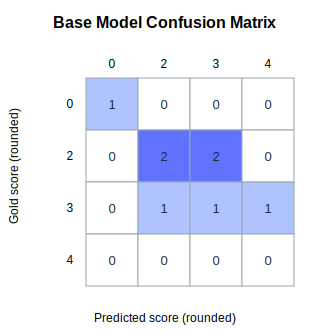
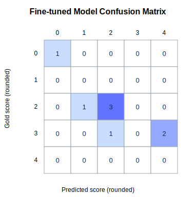
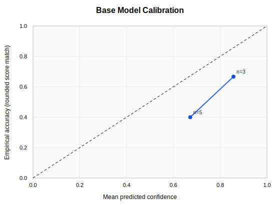
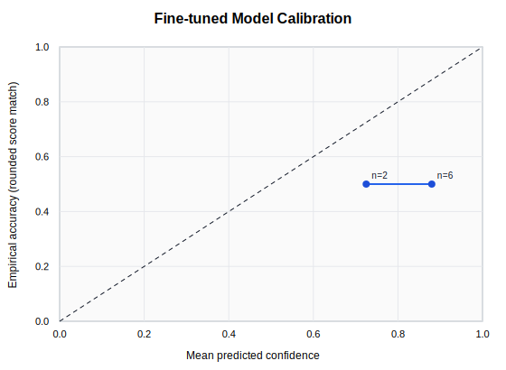

# Model v1 Results

## Scope

This report compares the available Base vs Fine-tuned prediction artifacts from:

- `outputs/evaluation/harness/eval-20260709T050351Z/base_predictions.jsonl`
- `outputs/evaluation/harness/eval-20260709T050351Z/tuned_predictions.jsonl`

## Data Validity Notes

- The latest Phase 1 training run (`outputs/training_runs/run_v1/run_v1`) failed before training due to missing GPU.
- These comparison predictions are from harness dry-run outputs (`reasoning` contains "Dry-run reasoning for harness validation.").
- Therefore, results below are **pipeline-validation metrics**, not a true post-training quality readout.

## Metrics

| Metric | Base Model | Fine-tuned Model | Delta (Fine - Base) |
|---|---:|---:|---:|
| QWK | 0.768116 | 0.797468 | +0.029352 |
| MAE | 0.593750 | 0.531250 | -0.062500 |
| Feedback quality | 0.712500 | 0.712500 | +0.000000 |
| Calibration ECE (5 bins) | 0.241250 | 0.341250 | +0.100000 |
| Calibration Brier | 0.311963 | 0.396263 | +0.084300 |

## Requested Dimensions

| Dimension | Status | Notes |
|---|---|---|
| Rubric adherence | Not directly measurable | No rubric labels/predictions in harness outputs. |
| Feedback quality | Measured | From harness per-example `feedback_quality`. |
| Logical reasoning | Proxy only | `reasoning_nonempty_rate` Base=1.000, Fine=1.000. |
| Fallacy detection | Not measurable | No gold fallacy labels or predicted fallacy fields in these artifacts. |
| Calibration | Measured (proxy target) | Target uses rounded-score exact match vs confidence. |

## Plots

### Confusion Matrices

### Calibration

## Conclusion

- On these dry-run artifacts, Fine-tuned appears better on QWK/MAE and calibration metrics.
- Because no trained adapter/merged model completed, treat this as a harness smoke-test result only.
